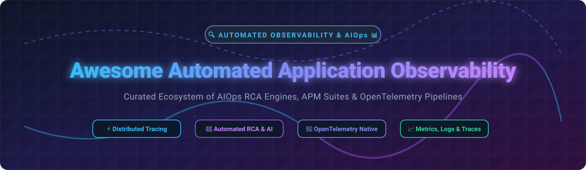

# Awesome-Automated-Application-Observability

# Awesome-Automated-Application-Observability 🔍 📊

  

  
  
  
  
  
  

---

## 🌟 Top Automated Application Observability Ecosystem

**Curated List of Commercial AIOps & Observability Platforms with Open-Source Telemetry Alternatives**  
*Focused on Automated Root Cause Analysis, Anomaly Detection, Distributed Tracing, Unified Logs/Metrics/Traces & Self-Hosted Observability Stacks*  

**Last updated: October 2026** 📅

---

### 📌 Overview & SEO Summary
Welcome to the ultimate curated directory of **automated application observability platforms**, **AIOps root cause analysis engines**, and **open-source telemetry pipelines**. Whether you are looking for enterprise-grade commercial solutions (such as *Datadog APM*, *Dynatrace Davis*, *New Relic Applied Intelligence*, and *Splunk ITSI*), or self-hostable open-source alternatives (like *SigNoz*, *Uptrace*, *Apache SkyWalking*, and *OpenTelemetry*), this list covers category leaders, causal AI engines, and privacy-respecting observability stacks.

---

## 📑 Table of Contents
- [🏢 SaaS & Commercial Platforms](#-saas--commercial-platforms)
- [🔓 Open-Source GitHub Projects](#-open-source-github-projects)
- [🛠️ How to Contribute](#%EF%B8%8F-how-to-contribute)
- [📊 Star History](#-star-history)
- [🤝 Support & Sponsorship](#-support--sponsorship)
- [⚠️ Disclaimer](#%EF%B8%8F-disclaimer)

---

## 🏢 SaaS / Commercial Platforms

The automated observability market has bifurcated into full-stack platforms (Datadog, Dynatrace, New Relic) that bundle APM, infrastructure, logs, and security, and specialized AIOps engines (ScienceLogic Skylar, Splunk ITSI) focused on root cause analysis and IT workflow automation. Pricing models are notoriously complex: Datadog charges per host plus indexed span overages at $1.70/million , New Relic uses consumption-based pricing with Compute Capacity Units , AppDynamics prices per CPU core starting at $6/month for Infrastructure and $33/month for Premium , ScienceLogic charges per managed device starting at $5/device/month for Skylar One Standard , and Splunk's ingest-based model with 2.0x overage rates creates significant negotiation complexity [citation:10].

| SaaS / Commercial Platform | Company / Owner | Valuation / Market Cap | Standard Edition Starting Price | Free Tier / Free Trial Limits | Description |
| :--- | :--- | :--- | :--- | :--- | :--- |
| **[Datadog APM](https://www.datadoghq.com/product/apm/)** 🐶 | Datadog Inc. | ~$40 Billion | $31/host/month (APM); $35 (Pro); $40 (Enterprise) | **14-day free trial**; no permanent free tier | **Full-stack observability with APM** — Distributed tracing, code profiling ($2/additional container beyond 4/host). Indexed spans: $1.70/million after 5M included per host. Ingested spans: $0.10/GB after 750 GB included [citation:5]. |
| **[Dynatrace Davis AI](https://www.dynatrace.com/)** 🔮 | Dynatrace | ~$15 Billion | Per-module pricing (Infrastructure, APM, Logs priced separately) | **15-day free trial**; no permanent free tier | **Causal AI for automated root cause** — Davis combines deterministic and causal AI with Smartscape topology graph to point directly at root cause, not just correlated anomalies. Agentic remediation layer (Dynatrace Intelligence) [citation:16]. |
| **[New Relic Applied Intelligence](https://newrelic.com/)** 🚀 | New Relic Inc. | ~$5 Billion | Usage-based: per GB ingested + Compute Capacity Units (CCUs) | **Free tier: 100 GB/month ingest + 1 full platform user** | **AI-powered incident intelligence** — Applied Intelligence includes Proactive Detection (first 100M transactions free, then $0.25/million) and Incident Intelligence (first 1,000 incidents free, then $0.50/incident) [citation:17]. |
| **[Cisco AppDynamics](https://www.appdynamics.com/)** 🎯 | Cisco (Acquired 2017) | ~$200 Billion (Cisco) | Infrastructure: $6/month per CPU Core; Premium: $33; Enterprise: $50 | **30-day free trial**; no permanent free tier | **Business performance monitoring** — Back-end and business transaction monitoring. Real User Monitoring: $0.06/month per 1,000 tokens. Cisco Secure Application: $13.75/month per CPU Core [citation:18]. |
| **[ScienceLogic Skylar](https://sciencelogic.com/)** 🔬 | ScienceLogic | Private | Skylar One Standard: $5/device/month (from); Advanced: $6 | **14-day Skylar One test drive**; no permanent free tier | **AIOps with predictive alerting** — Skylar Analytics (predictive alerting, anomaly detection) and Skylar Advisor (conversational interface) are quoted separately. Compliance plans: $12/device (Standard), $20/device (Advanced H/A) [citation:9][citation:19]. |
| **[Splunk ITSI](https://www.splunk.com/en_us/products/it-service-intelligence.html)** 📈 | Cisco (Acquired Splunk) | ~$200 Billion (Cisco) | Predictive Pricing tiers from 125 GB ingestion to unlimited | **Free up to 5 GB/day**; 60-day trial | **IT Service Intelligence** — KPI-based service monitoring with ML-driven anomaly detection. Ingest-based pricing with **2.0x overage rates** standard — negotiate to 1.2-1.5x for highest ROI [citation:10]. |
| **[Amazon CloudWatch Application Insights](https://aws.amazon.com/cloudwatch/)** ☁️ | Amazon | ~$2.0 Trillion | Pay-as-you-go: custom metrics $0.30/metric, alarms $0.10/alarm, log ingestion $0.05/GB | **Free tier: 10 custom metrics, 10 alarms, 5 GB logs** | **AWS-native application monitoring** — Automatically sets up recommended metrics and logs for application resources. X-Ray tracing: first 100K traces recorded free, then €0.000005/trace [citation:4][citation:14]. |
| **[Honeycomb](https://www.honeycomb.io/)** 🍯 | Honeycomb.io | Private | Pro: from $130/month (1.5B events); $3.00/million events | **Free: up to 20M events/month, 100M metrics data points** | **Event-based observability** — High-cardinality debugging, BubbleUp analysis, OpenTelemetry-native. Time Series Metrics and Honeycomb Intelligence included in 2026 Pro pricing. |
| **[Instana](https://www.ibm.com/products/instana)** ⚡ | IBM | ~$200 Billion | SaaS: from $21.20/MVS/month; Self-Hosted: from $385.20/MVS/year | **14-day free trial**; no permanent free tier | **Automated APM** — 1-second monitoring granularity, automatic discovery, 300+ technologies. Unlimited users. PayPerUse: $0.03/MVS-hour. Fair use: 325 GB data ingest per Standard SaaS MVS. |

---

## 🔓 Open-Source GitHub Projects

*Sorted by GitHub_Stars_Count (Descending)* 🌟

- **[Apache SkyWalking](https://github.com/apache/skywalking)**   
  **Observability platform for distributed systems**, Apache-2.0 licensed. ~24k+ stars. APM, service mesh telemetry, eBPF profiling, and metrics aggregation. Designed for cloud-native, microservices, and containerized architectures. CNCF graduated project. 🌌

- **[SigNoz](https://github.com/SigNoz/signoz)**   
  **Open-source Datadog alternative with OpenTelemetry-native APM**, Apache-2.0 licensed. ~22k+ stars. Unified logs, traces, and metrics in a single pane. ClickHouse-powered for high-cardinality data. Built-in dashboards, alerts, and exception tracking. Thoughtworks Technology Radar: Trial — reduces infrastructure resource consumption and overall observability costs without compromising performance [citation:1]. 📊

- **[Jaeger](https://github.com/jaegertracing/jaeger)**   
  **Distributed tracing platform by Uber**, Apache-2.0 licensed. ~21k+ stars. End-to-end distributed tracing, root cause analysis, service dependency analysis. OpenTelemetry-native. CNCF graduated project. 🕵️

- **[OpenTelemetry](https://github.com/open-telemetry/opentelemetry-collector)**   
  **Vendor-neutral observability framework**, Apache-2.0 licensed. ~7k+ stars for Collector; 100+ instrumentation libraries across languages. The emerging standard for telemetry collection. Supported natively by Datadog, New Relic, Dynatrace, Elastic, Splunk, Honeycomb, and Instana. 🔭

- **[Uptrace](https://github.com/uptrace/uptrace)**   
  **Open-source APM with OpenTelemetry**, BSD-2-Clause licensed. ~3k+ stars. Distributed tracing, metrics, and logs in a unified platform. ClickHouse-based. Processes **billions of spans on a single server** at 10x lower cost. 50+ pre-built dashboards, Grafana compatibility. Supports OpenTelemetry, Prometheus, Vector, FluentBit, CloudWatch ingestion [citation:3]. 📉

- **[Grafana Tempo](https://github.com/grafana/tempo)**   
  **High-scale distributed tracing backend**, AGPL-3.0 licensed. ~5k+ stars. Cost-efficient trace storage that only requires object storage. Deep integration with Grafana, Loki, and Prometheus. TraceQL query language. 📈

- **[Grafana Loki](https://github.com/grafana/loki)**   
  **Log aggregation system**, AGPL-3.0 licensed. ~26k+ stars. Like Prometheus but for logs. Indexes only metadata for cost efficiency. Integrated with Grafana for unified observability. 📝

- **[OpenObserve](https://github.com/openobserve/openobserve)**   
  **Cloud-native observability platform**, Apache-2.0 licensed. ~12k+ stars. Logs, metrics, traces, and RUM in one platform. **140x lower storage costs than Elasticsearch**. Rust-based, single binary. 🌊

- **[Pinpoint](https://github.com/pinpoint-apm/pinpoint)**   
  **APM for large-scale distributed systems**, Apache-2.0 licensed. ~13k+ stars. Java/PHP/Python agent-based monitoring with minimal performance impact. Call stack visualization, server map, and real-time active thread monitoring. 📍

- **[Hypertrace](https://github.com/hypertrace/hypertrace)**   
  **Observability platform for cloud-native apps**, Apache-2.0 licensed. ~1.5k+ stars. Distributed tracing, service graph, and trace-to-log correlation. Built on OpenTelemetry and Jaeger. 🔗

- **[FreeAiOps](https://github.com/FreeAiOps/FreeAiOps)**   
  **LLM-powered AIOps platform**, Apache-2.0 licensed. Integrates Zabbix, Prometheus, Grafana, ELK Stack, and more. Features **automated root cause analysis (RCA)**, intelligent fault prediction, and natural language interaction via LLM (GPT, LLaMA). Includes IT HelpDesk with LLM call center, IT operations assistant, and automated application inspection. Production-proven at telecom operators with 30-minute critical business inspection [citation:2]. 🤖

- **[GoSight Server](https://github.com/aaronlmathis/gosight-server)**   
  **High-performance observability backend in Go**, GPL-3.0-or-later licensed. Receives telemetry from OpenTelemetry, gRPC, and Syslog. **VictoriaMetrics integration** for metric and log storage. Rule-based alert evaluation, live WebSocket streaming, REST API, and reactive SvelteKit UI with ApexCharts [citation:13]. 📡

- **[Ongrid](https://github.com/ongridio/ongrid)**   
  **User-managed observability platform**, open-source. **embedded Loki, Tempo, and Grafana** with auth-gated data plane. AIOps service layer with LLM integration. RAG pipeline for knowledge base (chunk → embed → upsert). Skill marketplace and topology graph [citation:12]. 🗺️

- **[HoldFast](https://github.com/BrewingCoder/holdfast)**   
  **Self-hosted Highlight.io fork with zero paywall gating**, open-source. .NET 10 rewrite with 3,153 unit tests. Backend pods run at **128 MiB requests / 256 MiB limits** (vs 1-4 GiB in Go version). Removed Stripe, HubSpot, LaunchDarkly, and all SaaS-specific code. OTLP endpoints and GraphQL contracts preserved [citation:11]. 🛡️

---

## 🛠️ How to Contribute

Contributions are welcome! Follow these steps to submit new observability platforms or open-source AIOps software:

1. 🍴 **Fork** the repository.
2. 📝 **Add/edit** entries in `README.md` maintaining table/list structure and formatting.
3. 🔗 Include project title, official website/GitHub link, exact Stars_Count, license, and brief description.
4. 🚀 Submit a **Pull Request** with a descriptive summary of your changes.

---

## 📊 Star History

---

## 🤝 Support & Sponsorship

If you find this automated application observability repository useful, please consider supporting the project:

- ⭐ **Star** this repository to increase visibility!
- 🔀 **Fork** and share with fellow developers, SREs, and DevOps engineers.
- ☕ **Sponsor & Buy Me a Coffee**: Support ongoing open-source curation via the [GitHub Sponsor Dashboard](https://github.com/sponsors/ishandutta2007).

---

## ⚠️ Disclaimer

- This is a **community-curated** list — not exhaustive and not an endorsement. ℹ️
- Automated observability platforms ingest sensitive production telemetry. **Review data retention, sampling, and privacy policies** before committing. Datadog's indexed span retention defaults to 15 days [citation:5], while Splunk's ingest-based pricing carries 2.0x overage rates that can significantly impact budgets during incidents [citation:10]. 🔒
- Open-source observability solutions (SigNoz, Uptrace, SkyWalking, GoSight) provide self-hosted ownership and vendor neutrality, but enterprise-grade SLA guarantees, managed scaling, and 24/7 support remain primarily commercial offerings. 🔍

---

  <b>Made with ❤️ for developers, SREs, and open-source observability advocates.</b>

